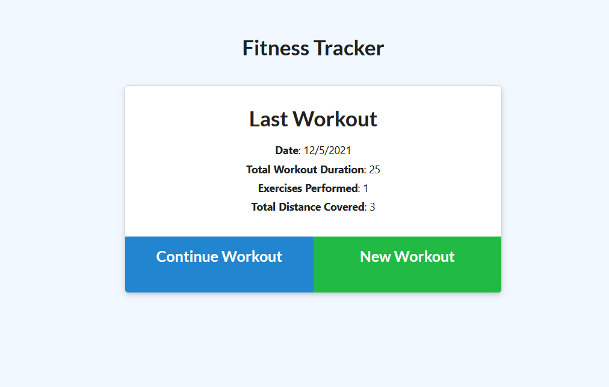
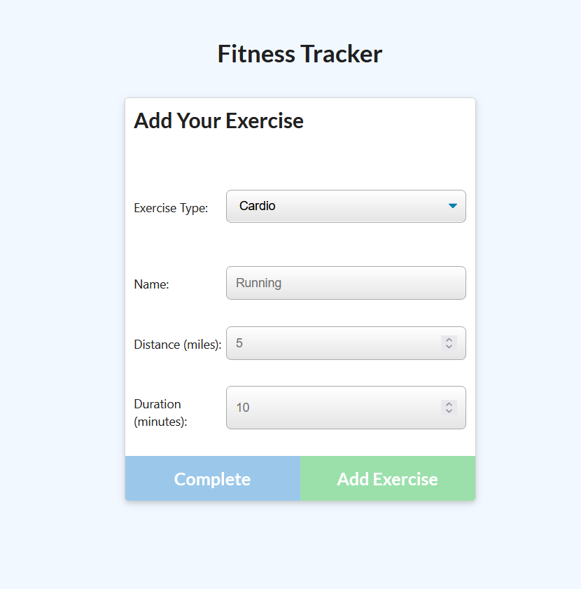
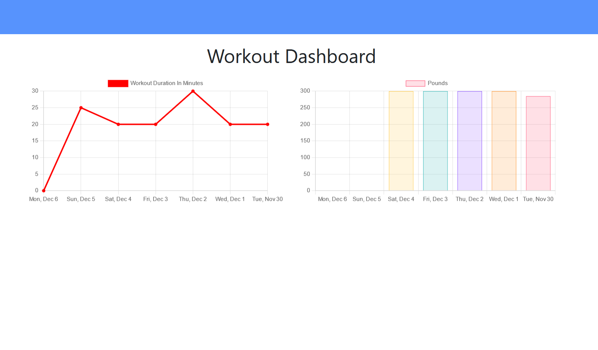

# fitnessTracker

## Description

An App utilizing Node, Express, and MongoDB to track multi-exericise workouts.

## Installation

After forking and cloning the repo to your local machine, run:

    npm install

This will install all dependencies. You will then need to create a .env file to store your MongoDB URI with the variable name "MONGODB_URI".

If you need test data, run:

    npm run seed

Which will populate your database with data for use while testing.

## Usage

This app can be used to track multi-exercise workouts that can incorporate resistance and cardio exercises. The landing page will show you your last workout and ask if you want to continue your workout (i.e., add more exercises to it) or start a new workout:

Clicking either will take you to the page to add an exercise to your workout. Once you choose resistance or cardio as the type, options will appear to describe your exercise:

(Note: clicking "Complete" will take you back to the landing page. Clicking "Add Exercise" will give you the option to continue adding exercises to the current workout).

A dashboard is also available to provide basic stats about the duration and weight lifted for past workouts:

## Questions

Please submit all questions to me via the issues section of the repo or directly to my github profile.

## Demo

A live demo can be found at: https://guarded-wave-20078.herokuapp.com/
